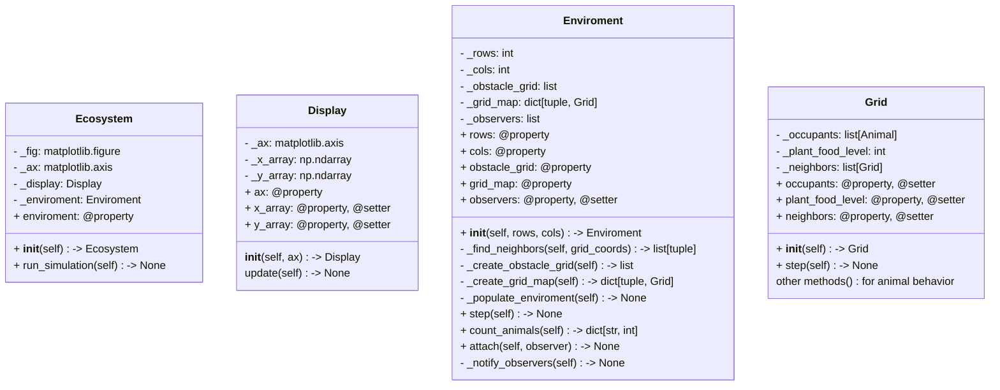

# EcoSysSim

## UML


## Set up the dev environment
1. Create a venv named 'venv'
```bash
python3 -m venv venv
```
2. Activate the venv
```bash
source venv/bin/activate
```
3. Install requirements.txt
```bash
pip install -r requirements.txt
```

## License
This software is licensed under the [`MIT-0`](https://github.com/aws/mit-0) license. The intent is to effectively place this work in the public domain.